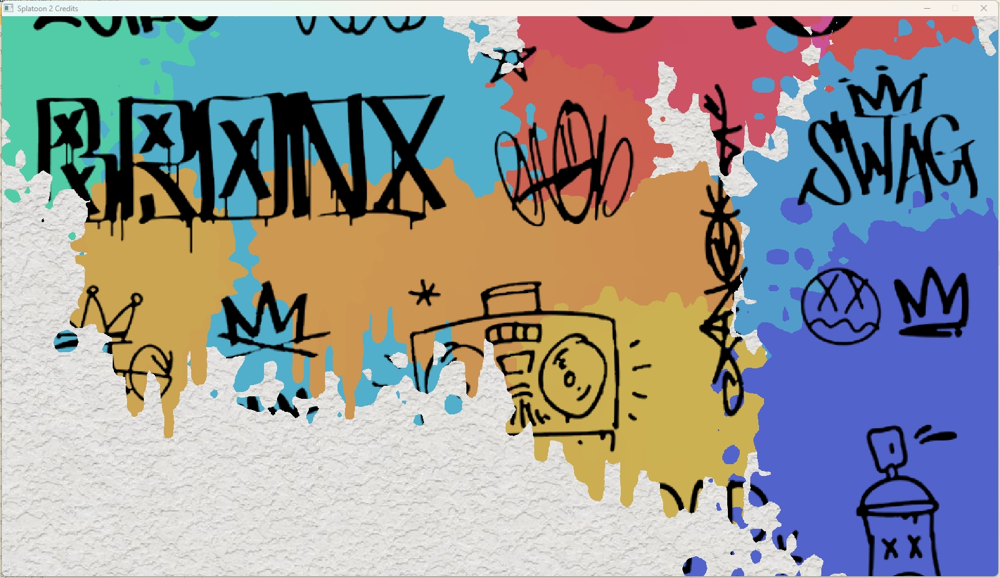

# Splatoon2-Credits

This is my individual course project for Graphics Programming course form IT Univeristy of Copenhagen.

Left-click to throw paint balloons, and right-click to spray paint. Painted wall would reveal hidden patterns. The color changes through out time. Left-click and right-click paint complimentary colors.

